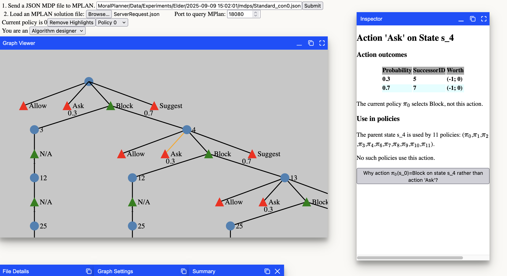

# Policy Explanation Tool for MoralPlanner


## About
Explainable tool for [Machine Ethics Hypothetical Retrospection Planner](https://github.com/sameysimon/MoralPlanner). Run planner with argument `--server` and use tool to send planning problems and interrogate policies.

## Features
- Visualize and interact with policy trees generated by the MoralPlanner.
- Inspect actions, states, and transitions.
- Highlight and explain argument attacks.
- Explore alternative, counterfactual policies.

## Getting Started
### Prerequisites
- Node.js, npm or yarn
- [React WinBox](https://www.npmjs.com/package/react-winbox)
- [D3: Data-Drive Documents](https://www.npmjs.com/package/d3)
- [Katex: Fast math typesetting for the web](https://www.npmjs.com/package/katex)

### Installation & Usage
Clone this repository and install dependencies:
```
git clone
cd explain_mplan
npm install
```
Recommend running as a development server and accessing through local host
```
npm start
```

Follow clone/build steps for the [Moral Planner](https://github.com/sameysimon/MoralPlanner)
```
git clone https://github.com/sameysimon/MoralPlanner.git
cd MoralPlanner
mkdir build
cd build
cmake ..
cmake --build .
```
Run the planner in server mode
```
./MPlan --server
```
## Gallery
### Inspect attacks on policies

### Inspect arguments
